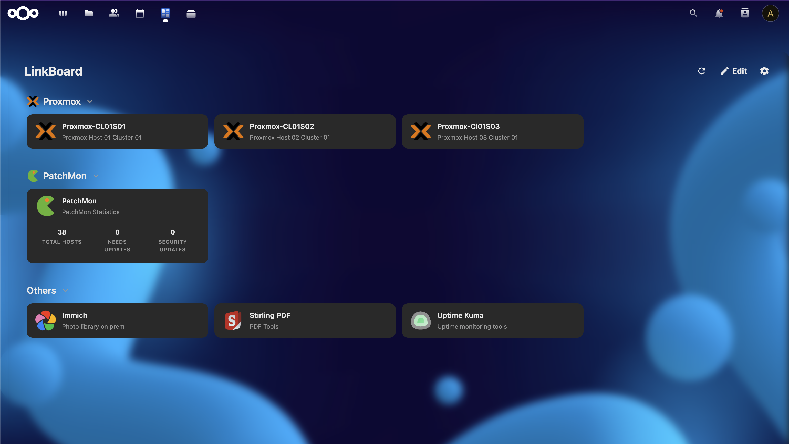
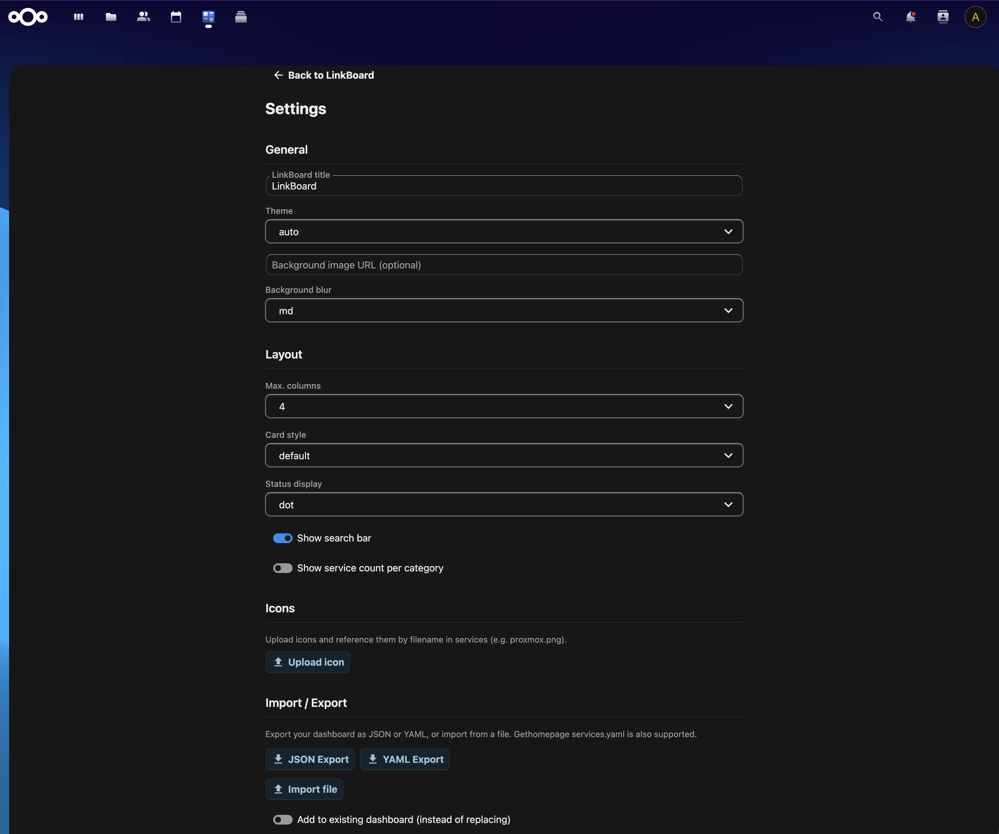

# LinkBoard

A beautiful, customizable service dashboard for Nextcloud.


---

## About

LinkBoard turns your Nextcloud into a personal homelab dashboard.
Organize all your self-hosted services in one place — with live status checks,
real-time widgets, custom icons, and a fully configurable layout.
Inspired by [Gethomepage](https://gethomepage.dev), but deeply integrated into Nextcloud.

## Screenshots

| Dashboard | Settings |
|-----------|----------|
|  |  |

## Features

- **Service Dashboard** – Organize services in categories with drag & drop sorting
- **Status Checks** – Live health checks with dot or border indicators
- **134 Built-in Widgets** – Real-time data from Proxmox, Patchman, Immich, Uptime Kuma, and 130+ more
- **Flexible Icons** – Upload custom images (PNG, SVG, WebP…), use Material Design Icons, or any URL
- **Theming** – Dark, light, or auto mode with custom background images and blur effects
- **Configurable Layout** – Adjust columns, card styles, search bar, and more
- **Import / Export** – YAML & JSON support, compatible with Gethomepage services.yaml
- **Keyboard Shortcuts** – `/` search, `E` edit, `R` refresh, `Esc` close
- **Multi-Language** – Full i18n support with 57 languages
- **Per-User** – Each Nextcloud user gets their own private dashboard

## Requirements

- Nextcloud 30, 31, 32, or 33
- PHP 8.1 – 8.4

## Installation

Download the latest release tarball and extract it into your Nextcloud `apps/` directory:

```bash
cd /path/to/nextcloud/apps
tar xzf linkboard-v1.0.0.tar.gz
```

Then enable the app:

```bash
php occ app:enable linkboard
```

## Development Setup

### Prerequisites

- Node.js 20+
- npm
- PHP 8.1+
- Composer
- A Nextcloud development instance

### Getting Started

```bash
cd /path/to/nextcloud/apps/
git clone https://github.com/tschuegy/linkboard-nextcloud.git linkboard
cd linkboard

composer install
npm install
npm run build

cd /path/to/nextcloud/
php occ app:enable linkboard
```

### Development Commands

```bash
npm run watch    # Auto-rebuild on changes
npm run build    # Production build
npm run lint     # Lint check
npm run lint:fix # Auto-fix lint issues
```

## Project Structure

```
linkboard/
├── appinfo/           # App metadata & routes
├── lib/               # PHP backend
│   ├── Controller/    # REST API controllers
│   ├── Db/            # Entity & mapper classes
│   ├── Service/       # Business logic
│   ├── Widget/        # 134 widget definitions
│   └── Migration/     # Database migrations
├── src/               # Vue.js frontend
│   ├── components/    # Vue components
│   ├── store/         # Pinia state management
│   └── services/      # API client
├── css/               # Global styles
├── img/               # App icon & screenshots
├── l10n/              # Translation files (57 languages)
└── templates/         # PHP templates
```

## API Overview

All endpoints under `/apps/linkboard/api/v1/`:

| Endpoint | Methods | Description |
|----------|---------|-------------|
| `/dashboard` | GET | Full dashboard (categories + services + settings) |
| `/categories` | GET, POST | List / create categories |
| `/categories/{id}` | GET, PUT, DELETE | Single category CRUD |
| `/categories/reorder` | PUT | Reorder categories |
| `/services` | GET, POST | List / create services |
| `/services/{id}` | GET, PUT, DELETE | Single service CRUD |
| `/services/reorder` | PUT | Reorder services |
| `/services/{id}/move/{catId}` | PUT | Move service to category |
| `/settings` | GET, PUT | User settings |
| `/icons` | GET, POST | List / upload icons |
| `/icons/{filename}` | GET, DELETE | Serve / delete icon |
| `/widgets/catalog` | GET | Available widget types |
| `/widgets/data` | POST | Fetch widget data |

## License

AGPL-3.0-or-later
