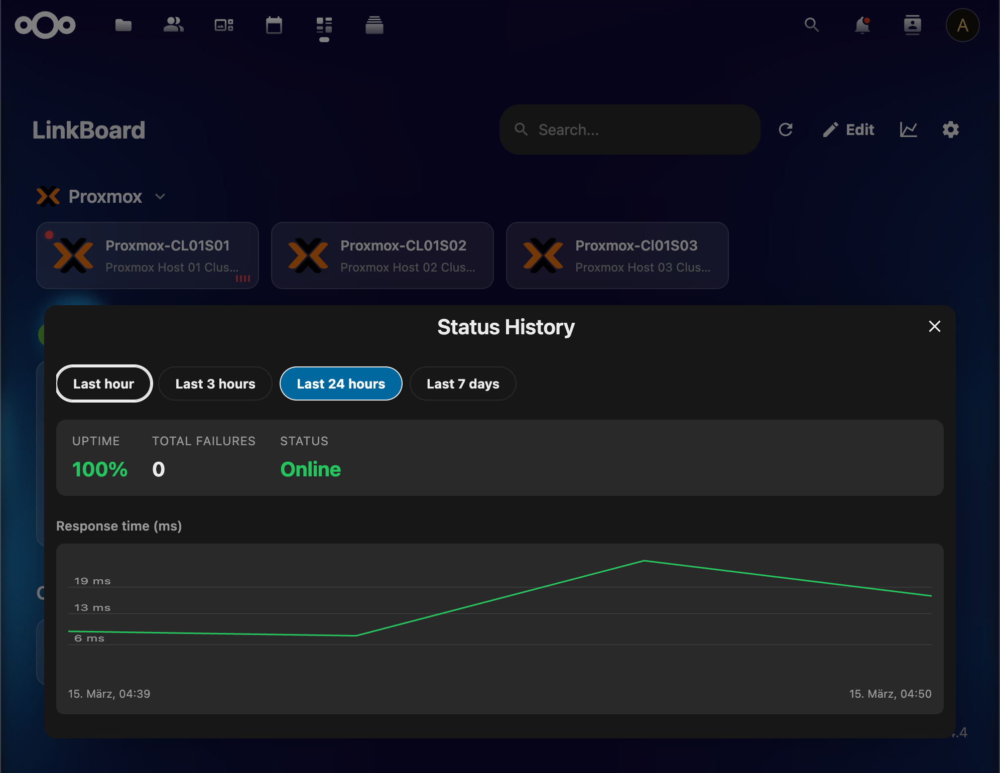
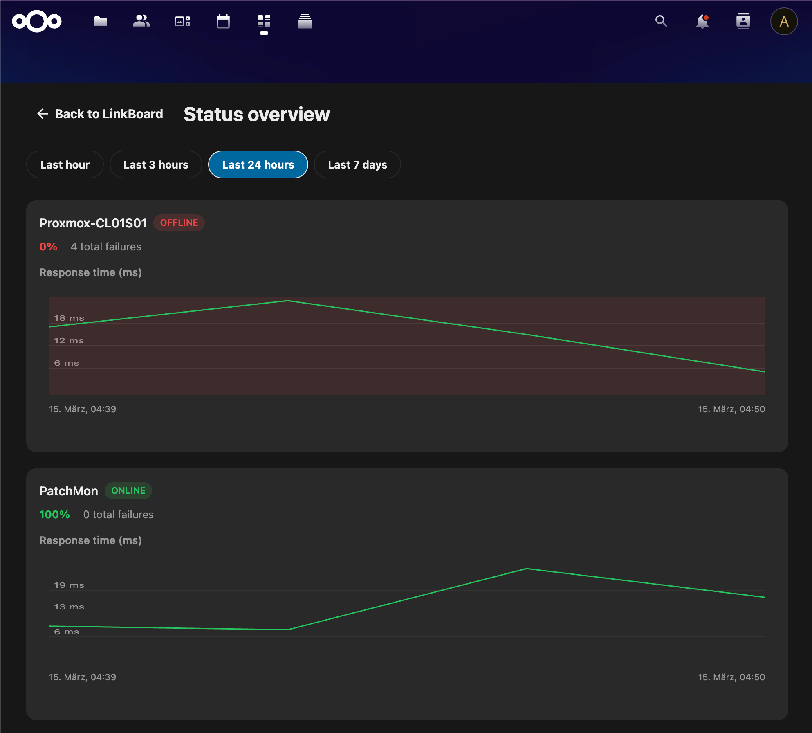
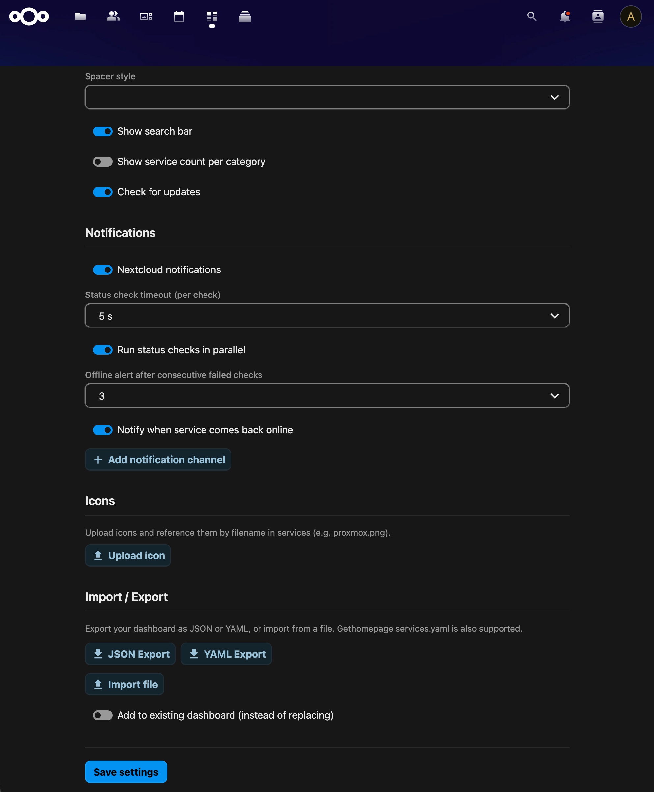

# LinkBoard

A beautiful, customizable service dashboard for Nextcloud.


[](https://github.com/sponsors/tschuegy)

---

## About

LinkBoard turns your Nextcloud into a personal homelab dashboard.
Organize all your self-hosted services in one place — with live status checks,
real-time widgets, custom icons, and a fully configurable layout.
Inspired by [Gethomepage](https://gethomepage.dev), but deeply integrated into Nextcloud.

## Screenshots

| | | |
|---|---|---|
|  |  |  |
|  |  | |

## Features

- **Service Dashboard** – Organize services in categories with drag & drop sorting
- **Grid Layout** – Grafana-style grid layout with free drag, resize, and placement of cards within categories
- **Configurable Grid** – Set grid granularity per category (6, 12, or 24 columns) with auto-arrange and row-height options
- **Edit Mode** – Lock/unlock edit mode toggle to prevent accidental changes
- **Status Checks** – Live health checks with dot or border indicators
- **Status History** – Response time charts, uptime tracking, and a dedicated status overview page
- **Offline Notifications** – Nextcloud notifications when services go down, with configurable threshold and recovery alerts
- **External Notification Channels** – 19 providers: Discord, Slack, Telegram, Matrix, Teams, Ntfy, Gotify, Pushover, E-Mail (SMTP), and more, with per-service overrides
- **136 Built-in Widgets** – Real-time data from Proxmox, Patchman, Immich, Uptime Kuma, and 130+ more; plus an inline-editable Table widget ([full list](WIDGETS.md))
- **System Resources** – Monitor CPU, memory, disk usage, uptime, and CPU temperature with progress bars
- **Category Spacers** – Decorative separator categories with multiple styles (solid, dashed, dotted, dots, stars, and more)
- **Flexible Icons** – Upload custom images (PNG, SVG, WebP…), use Material Design Icons (inline SVG), or any URL
- **Theming** – Dark, light, or auto mode with custom background images and blur effects
- **Card Styles** – Glass, Solid, Flat, or Transparent card backgrounds
- **Configurable Layout** – Adjust columns, card styles, search bar, and more
- **Import / Export** – YAML & JSON support, compatible with Gethomepage services.yaml
- **Keyboard Shortcuts** – Quick access via `/`, `E`, `R`, `Esc` ([see below](#keyboard-shortcuts))
- **Multi-Language** – Full i18n support with 57 languages
- **Per-User** – Each Nextcloud user gets their own private dashboard
- **Global Board** – Admins can designate one user's board as a shared read-only dashboard for all users
- **Group Restriction** – Optionally restrict LinkBoard access to specific Nextcloud groups

## Keyboard Shortcuts

| Key | Action |
|-----|--------|
| `/` | Focus search bar |
| `E` | Toggle edit mode |
| `R` | Refresh all (status checks, widgets, resources) |
| `Escape` | Close editor / exit edit mode / clear search |

> Shortcuts are disabled while typing in input fields. `E` and `R` are ignored when Ctrl/Cmd is held.

## Requirements

- Nextcloud 32 or 33
- PHP 8.2 – 8.4

## Administration

LinkBoard provides admin settings under **Settings > Administration > LinkBoard**.

### Group Restriction

By default, LinkBoard is available to all users. Admins can restrict access to specific Nextcloud groups. Only users in the selected groups (and admins) will see LinkBoard in the navigation.

### Global Board

Admins can enable a global board that replaces all personal dashboards with a single shared board:

1. Go to **Settings > Administration > LinkBoard**
2. Enable **"Show a global LinkBoard for all users"**
3. Select a user whose board should be displayed to everyone
4. Click **Save**

When active, all users see the selected user's board in read-only mode. Only admins can edit the global board (add/remove categories and services). Personal boards are preserved and will reappear when the global board is disabled.

### Status Checks & Cron

LinkBoard uses Nextcloud's background job system for periodic status checks. The minimum check interval is 1 minute, but **status checks can only run as often as Nextcloud's cron is triggered**.

Most Nextcloud installations use a system cron job that runs every 5 minutes by default. If you need 1-minute status checks, you must ensure the Nextcloud cron runs every minute.

#### Recommended: Systemd Timer (Linux)

Create the service file `/etc/systemd/system/nextcloud-cron.service`:

```ini
[Unit]
Description=Nextcloud cron.php
After=network.target

[Service]
User=www-data
ExecStart=/usr/bin/php /var/www/nextcloud/cron.php
```

Create the timer file `/etc/systemd/system/nextcloud-cron.timer`:

```ini
[Unit]
Description=Run Nextcloud cron.php every minute

[Timer]
OnBootSec=5min
OnUnitActiveSec=1min
Unit=nextcloud-cron.service

[Install]
WantedBy=timers.target
```

Enable and start the timer:

```bash
sudo systemctl daemon-reload
sudo systemctl enable --now nextcloud-cron.timer
```

Verify it's running:

```bash
systemctl list-timers | grep nextcloud
# Should show: nextcloud-cron.timer with ~1min interval
```

#### Alternative: Crontab

If you prefer a traditional crontab entry:

```bash
sudo crontab -u www-data -e
```

Add this line to run every minute:

```
* * * * * php /var/www/nextcloud/cron.php
```

> **Note:** Make sure **Settings > Administration > Basic settings > Background jobs** is set to **Cron** in your Nextcloud instance.

## Installation

Download the latest release tarball and extract it into your Nextcloud `apps/` directory:

```bash
cd /path/to/nextcloud/apps
tar xzf linkboard.tar.gz
```

Then enable the app:

```bash
cd /path/to/nextcloud/
php occ app:enable linkboard
```

## Development Setup

### Prerequisites

- Node.js 20+
- npm
- PHP 8.2+
- Composer
- A Nextcloud development instance

### Getting Started

```bash
cd /path/to/nextcloud/apps/
git clone https://github.com/tschuegy/linkboard-nextcloud.git linkboard
cd linkboard

composer install
npm install
npm run build

cd /path/to/nextcloud/
php occ app:enable linkboard
```

### Development Commands

```bash
npm run watch    # Auto-rebuild on changes
npm run build    # Production build
npm run lint     # Lint check
npm run lint:fix # Auto-fix lint issues
```

## Project Structure

```
linkboard/
├── appinfo/           # App metadata & routes
├── lib/               # PHP backend
│   ├── Controller/    # REST API controllers
│   ├── Db/            # Entity & mapper classes
│   ├── Service/       # Business logic
│   ├── Widget/        # 136 widget definitions
│   └── Migration/     # Database migrations
├── src/               # Vue.js frontend
│   ├── components/    # Vue components
│   ├── store/         # Pinia state management
│   └── services/      # API client
├── css/               # Global styles
├── img/               # App icon & screenshots
├── l10n/              # Translation files (57 languages)
└── templates/         # PHP templates
```

## API Overview

All endpoints under `/apps/linkboard/api/v1/`:

| Endpoint | Methods | Description |
|----------|---------|-------------|
| `/dashboard` | GET | Full dashboard (categories + services + settings) |
| `/categories` | GET, POST | List / create categories |
| `/categories/{id}` | GET, PUT, DELETE | Single category CRUD |
| `/categories/reorder` | PUT | Reorder categories |
| `/services` | GET, POST | List / create services |
| `/services/{id}` | GET, PUT, DELETE | Single service CRUD |
| `/services/reorder` | PUT | Reorder services |
| `/services/{id}/move/{catId}` | PUT | Move service to category |
| `/settings` | GET, PUT | User settings |
| `/icons` | GET, POST | List / upload icons |
| `/icons/{filename}` | GET, DELETE | Serve / delete icon |
| `/widgets/catalog` | GET | Available widget types |
| `/widgets/data` | POST | Fetch widget data |
| `/status/{id}/history` | GET | Status history for a service |
| `/status/history` | GET | Status history for all services |
| `/resources/{categoryId}` | GET | System resources (CPU, memory, disk) |

## License

AGPL-3.0-or-later
